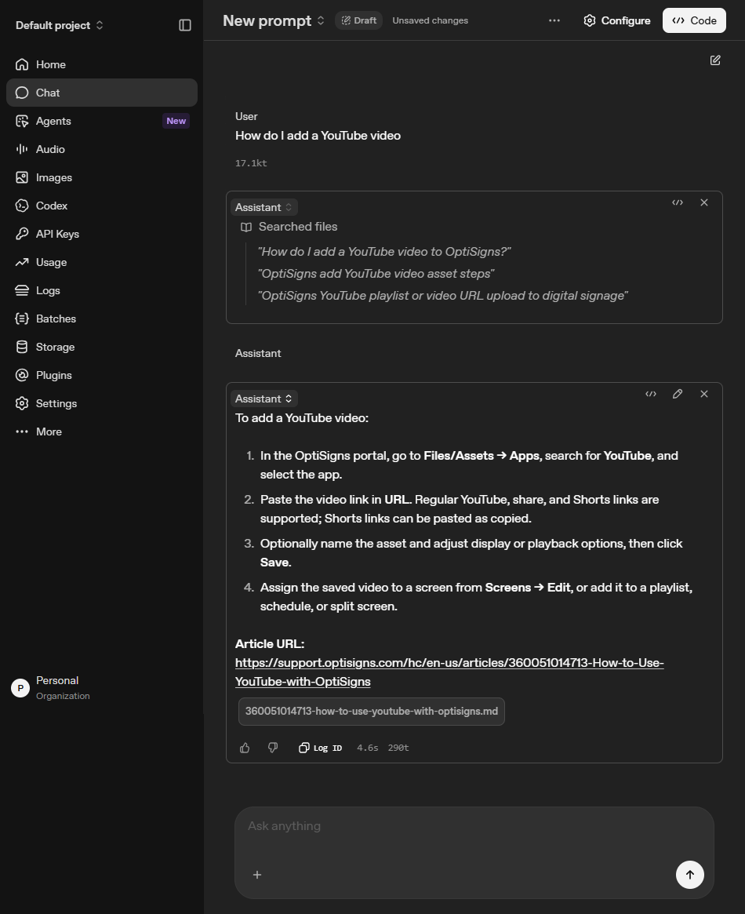

# Cryptic support assistant clone

## Setup

Requirements: Git and Docker.

```powershell
git clone https://github.com/4zure09/my-cryptic-clone.git
cd my-cryptic-clone
Copy-Item .env.sample .env
```

Set these values in `.env` without quotes or spaces around the values:

```env
OPENAI_API_KEY=your_openai_api_key
OPENAI_VECTOR_STORE_ID=your_vector_store_id
```

The store ID is validated through the OpenAI API before upload, so an invalid ID fails instead of creating a duplicate. Docker provides the remaining defaults: 40 articles, static chunks of 800 tokens with 120-token overlap, and temporary Markdown under `.runtime/articles`. Chunk estimates are logged with `tiktoken`.

For the daily job, add `OPENAI_API_KEY` as a GitHub Actions repository secret and `OPENAI_VECTOR_STORE_ID` as a repository variable.

## How to run locally

```powershell
docker build -t cryptic-clone .

# Test: scrape, normalize, and sync 40 articles
docker run --rm --env-file .env -e UPLOAD_ENABLED=true cryptic-clone main.py

# Daily-production equivalent: sync every published Zendesk article
docker run --rm --env-file .env -e UPLOAD_ENABLED=true -e ARTICLE_LIMIT=0 cryptic-clone main.py
```

Each run compares the Zendesk article ID and content hash stored in OpenAI file attributes. It uploads only added or updated files, skips unchanged files, and removes an article only after it is missing from two consecutive complete runs. Logs include `added`, `updated`, `skipped`, `deleted`, uploaded files, and estimated chunks.

Optional local verification:

```powershell
python -m venv .venv
.\.venv\Scripts\python.exe -m pip install -e ".[dev]"
.\.venv\Scripts\python.exe -m pytest -q -p no:cacheprovider
.\.venv\Scripts\python.exe -m ruff check .
```

## Link to daily job logs

[GitHub Actions — Daily support sync](https://github.com/4zure09/my-cryptic-clone/actions) runs daily at 02:17 in `Asia/Ho_Chi_Minh`. Each run publishes `last-run.log` as a downloadable artifact.

## Screenshot of assistant answering a sample question

The assistant answers **“How do I add a YouTube video?”** from the uploaded documents and cites the source article URL.


